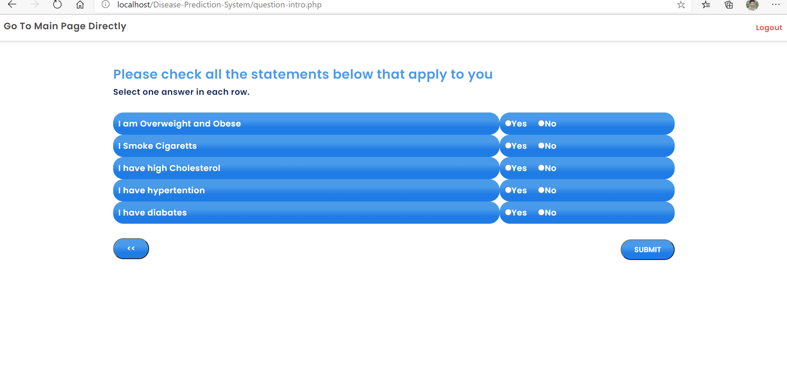
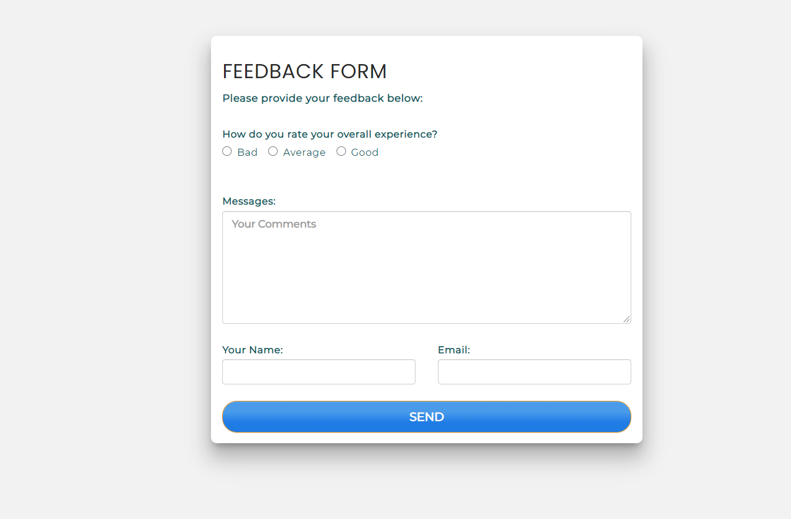

# Disease-Prediction-System using PHP.

This Project is to predict the disease based on your Symptoms. Here, I use HTML, CSS, JavaScript, PHP, MySql, and JQuery.Before Entering the project first, insert the database into the SQL database. The database file is given inside the project.

## Here, I am trying to do this project using core PHP.

#### Project Description: This Project predicts the disease based on your symptoms. The main objective of an e-healthcare System is to provide Accuracy, Immediate retrieval of information, No Redundancy, Immediate storage of information, Easy to Operate. This project is developing to decrease the work that is done manually at Hospitals. Every single step is done with the help of the system, services such as employees, appointments in the database, inquiries as well as complaints of customers. E-Health care system will help in reducing lots of paperwork and file work in these hospitals which will make easy management of hospital. It will also provide all the latest information to the management and hospital administration wherever they ask. The interactions between the hospital and can be simplified for the convenience of both sides. The speed of obtaining and processing the details will be very fast. Our project is concerned with the organization, coordination, planning, staffing, evaluation, and control of health services for the masses. As we are providing an online appointment facility patients also benefit from using this system. They can get the work done within no time.

#### Restriction: You can only check the front part of your body. And I am not working with the female part.

#### Cautions: You Cannot surely 100% sure that this is the right disease. It's just analyzing the symptoms and based on that symptoms that produce output.

#### Credits: 1) Shoibe Akter 2) Dhruv Rastogi 3) Shoumil Sachan 4) Aryan Saini

##### Note: This Project is Not fully Responsive 

##### For log in or you can Registration 

For Admin Login UserName: admin 
                Password: Ab123456

For User Login UserName: user
               Password:Ab123456

#### Some Samples of this project are given below :

